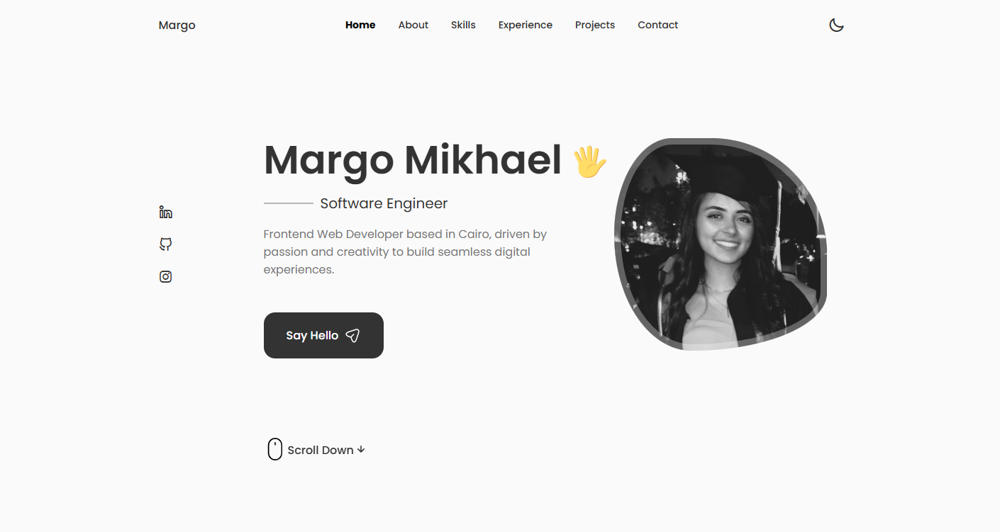

# My Personal Portfolio

A responsive portfolio website built with React.js, showcasing projects, skills, and contact info with a clean, interactive design.



## Features

- **Responsive Design**: Adapts to different screen sizes for a seamless user experience on any device.
- **Interactive UI**: Engaging and interactive user interface built with modern web technologies.
- **Dark Mode**: Toggle between light and dark themes for a personalized experience.
- **Project Showcase**: Display your projects with live demos and source code links.
- **Contact Form**: Allow visitors to get in touch with you directly through the website.

## Technologies Used

- **React.js**: JavaScript library for building user interfaces.
- **CSS**: Styling the website with custom CSS.
- **JavaScript**: Adding interactivity to the website.
- **HTML**: Structuring the content of the website.

## Getting Started

To get a local copy up and running, follow these simple steps:

### Installation

1. Clone the repository:
   ```sh
   git clone https://github.com/Margo-Mikhael/my-portfolio.git
   ```
